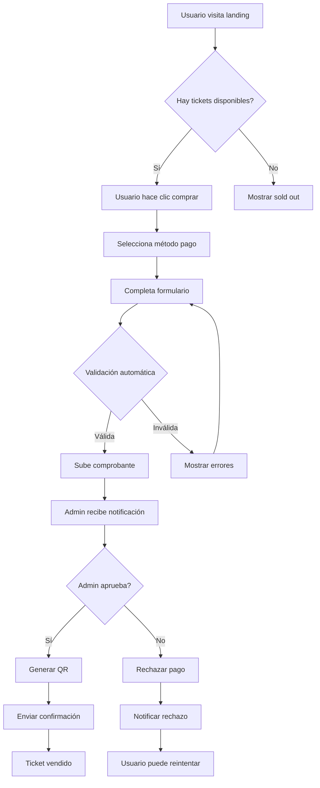
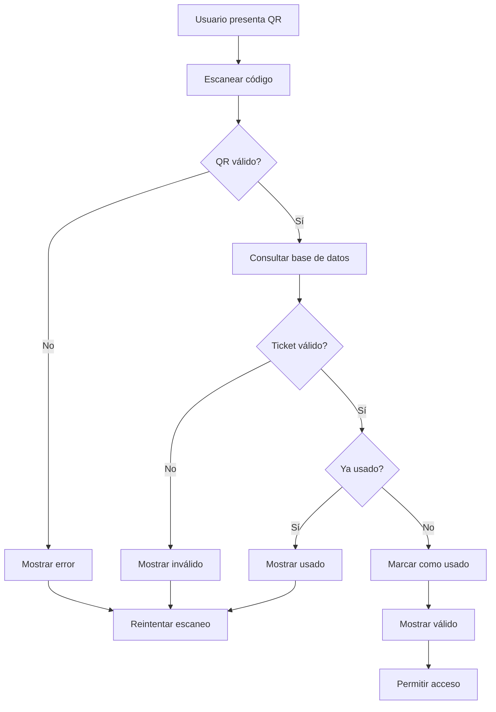

# 📋 LÓGICA DE NEGOCIO LA MUBI - SISTEMA DE TICKETS
*Fecha: 28 de marzo 2026*

## 🎯 OBJETIVO PRINCIPAL
Sistema de venta y validación de tickets digitales con códigos QR para eventos LA MUBI, enfocado en el mercado venezolano con métodos de pago locales y optimización móvil.

---

## 🏢 MODELO DE NEGOCIO

### Propósito del Sistema
- **Evento Principal**: LA MUBI 2024 - Experiencia inolvidable
- **Público Objetivo**: Jóvenes venezolanos 18-35 años, tech-savvy
- **Propuesta de Valor**: Tickets digitales accesibles sin necesidad de tarjetas de crédito
- **Mercado**: Venezuela - Adaptado a realidades económicas locales

### Estrategia de Precios
- **Precio Fijo**: $5.00 USD por ticket
- **Justificación**: 
  - Accesible para mercado venezolano
  - Por debajo de competencia ($10-15 USD)
  - Compatible con métodos de pago locales
- **Capacidad**: 700 tickets totales (limitado por venue capacity)
- **Scarcity Strategy**: Countdown timer + contador de disponibilidad

### Métodos de Pago Estratégicos
- **Pago Móvil**: Principal método venezolano
  - Banco central: Transferencias entre bancos
  - Instantáneo y sin comisiones
  - Adaptado a realidad económica local
- **Zelle**: Método internacional
  - Para usuarios con cuentas USD
  - Transferencias entre bancos EE.UU.
  - Complemento para mercado expatriado
- **Legacy Methods** (configurados pero desactivados):
  - Efectivo: Eliminado por complejidad logística
  - QR Code: Eliminado por baja adopción

### Configuración Técnica del Negocio
```javascript
// Business Configuration
const BUSINESS_CONFIG = {
    TICKETS: {
        PRECIO_USD: 5.00,                    // Precio estratégico fijo
        METODOS_PAGO: ['pago-movil', 'zelle'], // Solo métodos activos
        EVENTO: {
            NOMBRE: 'LA MUBI 2024',
            FECHA: '2024-02-15',
            HORA: '20:00',
            UBICACION: 'Caracas, Venezuela'
        }
    },
    STORAGE: {
        BUCKET: 'lamubi-qr-comprobantes',     // Branding en storage
        MAX_SIZE: 5 * 1024 * 1024,           // 5MB límite práctico
        ALLOWED_TYPES: ['image/jpeg', 'image/png', 'image/webp', 'image/heic'],
        COMPRESSION: {
            MAX_WIDTH: 800,                   // Optimizado para mobile
            MAX_HEIGHT: 600,
            QUALITY: 0.7,                     // Balance calidad/size
            TARGET_SIZE: 200 * 1024           // 200KB objetivo
        }
    }
};
```

---

## 💰 MODELO DE INGRESOS

### Estructura de Precios
```
Ticket Base: $5.00 USD
├── Costo procesamiento Pago Móvil: ~$0.10 USD
├── Costo procesamiento Zelle: ~$0.25 USD
├── Infraestructura digital: ~$0.15 USD
└── Margen neto: ~$4.50 USD (90%)
```

### Proyección de Ingresos
- **Capacidad Total**: 700 tickets × $5.00 = $3,500 USD
- **Ocupación Actual**: 186 tickets vendidos = $930 USD
- **Conversión Actual**: 26.5% (186/700)
- **Proyección 80%**: 560 tickets = $2,800 USD
- **ROI Esperado**: 90% margen sobre ingresos

### Costos Operativos
- **Infraestructura**: Supabase ($25/mes) + Vercel ($20/mes) = $45/mes
- **Procesamiento pagos**: Variable por transacción
- **Marketing**: Orgánico (bajo costo)
- **Soporte**: Manual (administrador)

---

## 🔄 PROCESOS DE NEGOCIO

### Flujo de Venta (Customer Journey)
```
1. Descubrimiento → Landing page con countdown
2. Interés → Contador de disponibilidad + urgencia
3. Consideración → Selección método de pago
4. Compra → Formulario + validación dinámica
5. Pago → Referencia/Zelle + comprobante
6. Confirmación → QR generado + email
7. Validación → Escaneo en evento
8. Acceso → Ingreso al evento
```

### Proceso de Validación de Pagos
```
1. Usuario completa formulario
2. Sistema valida formato (regex)
3. Sistema calcula monto esperado (tasa × 5)
4. Usuario sube comprobante
5. Sistema comprime y almacena imagen
6. Administrador recibe notificación
7. Admin aprueba/rechaza manualmente
8. Sistema genera QR si aprobado
9. Usuario recibe confirmación
```

### Lógica de Aprobación Administrativa (Business Critical)
```javascript
// Admin Approval Business Logic (del código actual)
class AdminApprovalLogic {
    getMultiInfo(record) {
        const safeInt = (value, fallback) => {
            const n = parseInt(value, 10);
            return Number.isFinite(n) ? n : fallback;
        };

        let purchase = null;
        if (record && record.datos_compra) {
            try {
                const raw = typeof record.datos_compra === 'string' ? JSON.parse(record.datos_compra) : record.datos_compra;
                purchase = raw && raw.purchase ? raw.purchase : null;
            } catch (e) {
                console.warn('Error parsing datos_compra:', e);
                purchase = null;
            }
        }

        return {
            id: safeInt(record?.id, 0),
            email_temporal: record?.email_temporal || '',
            metodo_pago: record?.metodo_pago || '',
            monto: parseFloat(record?.monto) || 0,
            referencia: record?.referencia || '',
            estado: record?.estado || '',
            created_at: record?.created_at || '',
            purchase: purchase,
            // Business logic: Validar integridad de datos
            isValid: this.validateRecord(record),
            warnings: this.getWarnings(record)
        };
    }

    validateRecord(record) {
        const required = ['email_temporal', 'metodo_pago', 'monto', 'referencia'];
        return required.every(field => record[field]);
    }

    getWarnings(record) {
        const warnings = [];
        
        // Business rule: Validar monto contra tasa
        if (record.metodo_pago === 'pago-movil' && record.monto) {
            const expectedAmount = record.tasa_dolar * 5;
            if (Math.abs(record.monto - expectedAmount) > 0.01) {
                warnings.push('Monto no coincide con tasa actual');
            }
        }
        
        // Business rule: Validar formato referencia
        if (record.metodo_pago === 'pago-movil' && record.referencia) {
            if (!/^[0-9]{8,12}$/.test(record.referencia)) {
                warnings.push('Formato de referencia inválido');
            }
        }
        
        return warnings;
    }

    // Business logic: Búsqueda inteligente
    buildSearchQuery(search) {
        if (!search || search.trim() === '') return null;
        
        const escaped = search.replace(/[%_\\]/g, '\\$&');
        return query.or(`email_temporal.ilike.%${escaped}%,referencia.ilike.%${escaped}%`);
    }
}
```

### Reglas de Validación Automática
```javascript
// Pago Móvil
if (metodo === 'pago-movil') {
    const montoEsperado = tasaDolar * 5;
    const montoValido = parseFloat(monto) === montoEsperado;
    const referenciaValida = /^[0-9]{8,12}$/.test(referencia);
    
    return montoValido && referenciaValida;
}

// Zelle
if (metodo === 'zelle') {
    const confirmacionValida = /^ZEL[A-Z0-9]{6,10}$/.test(confirmacion);
    const emailValido = /^[a-zA-Z0-9._%+-]+@[a-zA-Z0-9.-]+\.[a-zA-Z]{2,}$/.test(email);
    
    return confirmacionValida && emailValido;
}
```

---

## 🎯 REGLAS DE NEGOCIO

### Reglas de Precios
- **Precio Único**: $5.00 USD sin variaciones
- **Sin Descuentos**: No hay descuentos por volumen
- **Sin Comisiones Adicionales**: Precio final incluye todo
- **Tasa Dinámica**: Tasa dólar actualizable desde admin

### Reglas de Métodos de Pago
- **Pago Móvil**: Solo referencias numéricas 8-12 dígitos
- **Zelle**: Confirmación debe empezar con "ZEL"
- **Comprobantes**: Máximo 5MB, formatos específicos
- **Validación**: Formato estricto con regex

### Reglas de Capacidad
- **Límite Total**: 700 tickets por evento
- **Sin Overbooking**: No vender más del disponible
- **Contador Real**: Actualizado en tiempo real
- **Urgencia Visual**: Indicadores rojos < 100 tickets

### Reglas de Tiempo y Moneda
- **Countdown**: Tiempo restante hasta evento
- **Validación**: 500ms debounce para evitar bucles
- **Timestamps**: UTC-4 para todos los registros
- **Expiración**: Tickets válidos solo día del evento
- **Tasa Dinámica**: Actualizable desde admin en tiempo real

### Lógica de Tasa de Cambio (Business Critical)
```javascript
// Exchange Rate Business Logic (del código actual)
async function obtenerTasaDolar() {
    // Reintento silencioso si config.js aún no termina
    let intentos = 0;
    const maxIntentos = 10;
    
    while (!window.LAMUBI_UTILS?.supabase && intentos < maxIntentos) {
        console.log(`⏳ Esperando Supabase... intento ${intentos + 1}/${maxIntentos}`);
        await new Promise(resolve => setTimeout(resolve, 200));
        intentos++;
    }

    const supabase = window.LAMUBI_UTILS?.supabase;

    if (!supabase) {
        console.error("⛔ Supabase no inicializado tras esperar.");
        return 0; // Valor seguro para business continuity
    }

    try {
        const { data, error } = await supabase
            .from('configuracion_sistema')
            .select('tasa_dolar')
            .eq('id', 1)
            .single();

        if (error) throw error;
        
        const tasa = parseFloat(data?.tasa_dolar) || 0;
        
        // Business rule: Validar tasa está en rango razonable
        if (tasa < 10 || tasa > 100) {
            console.warn(`⚠️ Tasa sospechosa: ${tasa}. Usando valor seguro.`);
            return 35; // Valor seguro por defecto
        }
        
        return tasa;
        
    } catch (error) {
        console.error("❌ Error obteniendo tasa:", error);
        return 35; // Valor seguro por defecto para business continuity
    }
}

// Business rule: Calcular monto esperado
function calcularMontoEsperado(tasa) {
    const monto = tasa * 5; // $5.00 USD
    
    // Business rule: Formatear para Venezuela
    return new Intl.NumberFormat('es-VE', {
        style: 'currency',
        currency: 'VES',
        minimumFractionDigits: 2,
        maximumFractionDigits: 2
    }).format(monto);
}
```

### Reglas de Conversión Monetaria
- **Tasa Base**: Dólar americano a Bolívares
- **Precio Fijo**: $5.00 USD (no negociable)
- **Monto Esperado**: tasa_dolar × 5 (cálculo dinámico)
- **Validación**: Margen de error ±0.01 Bs.
- **Formateo**: Locale 'es-VE' para用户体验

---

## 📊 MÉTRICAS DE NEGOCIO (KPIs)

### KPIs de Ventas
- **Tasa de Conversión**: Tickets vendidos / visitantes únicos
- **Ingresos por Hora**: Revenue dividido por tiempo activo
- **Ticket Promedio**: $5.00 (constante)
- **Velocidad de Venta**: Tickets por día/semana

### KPIs de Operación
- **Tiempo de Aprobación**: Tiempo promedio admin aprueba pago
- **Tasa de Rechazo**: Pagos rechazados / totales
- **Errores de Validación**: Formularios con errores / totales
- **Upload Success**: Comprobantes subidos exitosamente

### KPIs de Usuario
- **Tiempo en Página**: Engagement en landing
- **Abandono de Carrito**: Formularios iniciados vs completados
- **Métodos Populares**: % uso Pago Móvil vs Zelle
- **Dispositivos**: Mobile vs Desktop vs Tablet

### KPIs Técnicos
- **Uptime**: Disponibilidad del sistema
- **Performance**: Tiempo de carga de páginas
- **Error Rate**: Errores de sistema / requests totales
- **Storage Usage**: Espacio utilizado en Supabase

---

## 🔧 REGLAS DE VALIDACIÓN TÉCNICA

### Validación de Entrada (Input Validation)
```javascript
// Business Rules Layer
class BusinessValidation {
    static validatePayment(data) {
        const rules = {
            'pago-movil': {
                monto: {
                    required: true,
                    type: 'number',
                    min: 0.01,
                    custom: (value, context) => {
                        const expected = context.tasaDolar * 5;
                        return Math.abs(value - expected) < 0.01;
                    }
                },
                referencia: {
                    required: true,
                    type: 'string',
                    pattern: /^[0-9]{8,12}$/,
                    message: 'Debe tener 8-12 dígitos numéricos'
                }
            },
            'zelle': {
                confirmacion: {
                    required: true,
                    type: 'string',
                    pattern: /^ZEL[A-Z0-9]{6,10}$/,
                    message: 'Debe empezar con ZEL + 6-10 caracteres'
                },
                email: {
                    required: true,
                    type: 'email',
                    message: 'Email válido requerido'
                }
            }
        };
        
        return this.applyRules(data, rules[data.metodo]);
    }
}
```

### Validación de Negocio (Business Logic)
```javascript
// Business Logic Layer
class BusinessRules {
    static canSellTicket() {
        const soldTickets = this.getSoldTicketsCount();
        const totalCapacity = 700;
        
        return soldTickets < totalCapacity;
    }
    
    static calculateExpectedAmount(tasaDolar) {
        return tasaDolar * 5; // $5.00 USD
    }
    
    static isPaymentValid(payment) {
        const expectedAmount = this.calculateExpectedAmount(payment.tasaDolar);
        
        switch (payment.metodo) {
            case 'pago-movil':
                return this.validatePagoMovil(payment, expectedAmount);
            case 'zelle':
                return this.validateZelle(payment);
            default:
                return false;
        }
    }
    
    static validatePagoMovil(payment, expectedAmount) {
        const amountValid = Math.abs(payment.monto - expectedAmount) < 0.01;
        const referenceValid = /^[0-9]{8,12}$/.test(payment.referencia);
        
        return amountValid && referenceValid;
    }
    
    static validateZelle(payment) {
        const confirmationValid = /^ZEL[A-Z0-9]{6,10}$/.test(payment.confirmacion);
        const emailValid = /^[a-zA-Z0-9._%+-]+@[a-zA-Z0-9.-]+\.[a-zA-Z]{2,}$/.test(payment.email);
        
        return confirmationValid && emailValid;
    }
}
```

### Validación en Tiempo Real (Real-time Validation)
```javascript
// Real-time Business Validation (del código actual)
class ValidacionCampos {
    constructor() {
        this.colores = {
            primario: '#bb1175',
            secundario: '#f43cb8',
            acento: '#f361e5',
            exito: '#11bb75',
            advertencia: '#f59e0b',
            error: '#ef4444'
        };
    }
    
    validarCampo(campoId, metodoPago) {
        const campo = document.getElementById(campoId);
        if (!campo) return false;

        const valor = campo.value.trim();
        const tipoCampo = this.obtenerTipoCampo(campoId);
        const estandar = this.estandares[metodoPago][tipoCampo];

        if (!estandar) return true; // Si no hay estándar, es válido

        // Validación según tipo
        let esValido = false;
        let mensajeError = '';
        
        // Business rule validation
        if (estandar.regex) {
            esValido = estandar.regex.test(valor);
            if (!esValido) {
                mensajeError = estandar.mensaje;
            }
        }
        
        if (estandar.required && !valor) {
            esValido = false;
            mensajeError = 'Este campo es requerido';
        }
        
        // UI feedback con colores de negocio
        this.mostrarValidacion(campo, esValido, mensajeError);
        
        return esValido;
    }
}
```

---

## 🔄 FLUJOS DE TRABAJO (WORKFLOWS)

### Workflow de Venta


### Workflow de Validación


### Lógica de Validación QR (Business Critical)
```javascript
// QR Validation Business Logic (del código actual)
class MubiScanner {
    constructor(elementId, onResult) {
        this.scanner = null;
        this.elementId = elementId;
        this.onResult = onResult;
        this.isScanning = false;
        
        // Business rule: Configuración optimizada para móviles
        this.config = { 
            fps: 15, // Más FPS para mejor detección
            qrbox: { width: 250, height: 250 },
            aspectRatio: 1.0
        };
    }

    async start() {
        try {
            console.log('🎯 Iniciando MubiScanner...');
            
            if (this.isScanning) {
                console.log('⚠️ El escáner ya está activo');
                return { success: false, error: 'Escáner ya activo' };
            }

            // Business rule: Verificación automática de HTTPS
            if (window.location.protocol !== 'https:' && window.location.hostname !== 'localhost') {
                throw new Error("La cámara requiere HTTPS. Usa localhost o una conexión segura.");
            }

            // Business rule: Verificar API disponible
            if (!navigator.mediaDevices || !navigator.mediaDevices.getUserMedia) {
                throw new Error("Camera API no disponible en este navegador");
            }

            // Business rule: Configuración de cámara optimizada
            const cameraConfig = {
                facingMode: 'environment', // Cámara trasera para tickets
                width: { ideal: 1280 },
                height: { ideal: 720 }
            };
            
            console.log('📹 Configuración de cámara:', cameraConfig);
            
            // Business rule: Retry mechanism para robustez
            let retryCount = 0;
            const maxRetries = 2;
            
            while (retryCount < maxRetries) {
                try {
                    await this.scanner.start(
                        cameraConfig,
                        this.config,
                        (decodedText) => {
                            console.log('🎫 QR detectado:', decodedText);
                            this.stop(); // Detener al encontrar éxito
                            this.onResult(decodedText);
                        },
                        (errorMessage) => {
                            // Business rule: Silenciar errores continuos para mejor UX
                            // console.log('⚠️ Error de escaneo:', errorMessage);
                        }
                    );
                    
                    this.isScanning = true;
                    return { success: true };
                    
                } catch (error) {
                    retryCount++;
                    if (retryCount >= maxRetries) {
                        throw error;
                    }
                    await new Promise(resolve => setTimeout(resolve, 1000));
                }
            }
            
        } catch (error) {
            console.error('❌ Error iniciando escáner:', error);
            return { success: false, error: error.message };
        }
    }
}
```

---

## 📱 ESTRATEGIA MULTIPLATAFORMA

### Mobile-First Strategy
- **Prioridad**: 70% tráfico móvil esperado
- **Optimización**: iOS + Android específico
- **Touch Events**: Swipe gestures y touch optimization
- **Camera API**: QR scanning nativo
- **Safe Areas**: iOS notches handling

### Platform-Specific Features
```javascript
// Platform Detection
class PlatformStrategy {
    static getOptimizations() {
        const isIOS = /iPad|iPhone|iPod/.test(navigator.userAgent);
        const isAndroid = /Android/.test(navigator.userAgent);
        const isMobile = isIOS || isAndroid;
        
        return {
            camera: {
                ios: 'native-camera-api',
                android: 'web-camera-api',
                desktop: 'upload-fallback'
            },
            fonts: {
                ios: '-apple-system, BlinkMacSystemFont',
                android: 'Roboto',
                desktop: 'Montserrat'
            },
            payment: {
                ios: 'optimized-touch',
                android: 'optimized-touch',
                desktop: 'keyboard-friendly'
            }
        };
    }
}
```

---

## 🔐 SEGURIDAD DE NEGOCIO

### Validación de Datos
- **Input Sanitization**: Todos los inputs validados con regex
- **SQL Injection Prevention**: Supabase RLS policies
- **XSS Prevention**: Text content only, no HTML
- **CSRF Protection**: Tokens en forms

### Protección de Datos
- **PII Protection**: No almacenar datos sensibles
- **GDPR Compliance**: Consentimiento implícito
- **Data Minimization**: Solo datos necesarios
- **Secure Storage**: Supabase encryption

### Validación de Archivos
```javascript
// File Upload Security
class FileSecurity {
    static validateComprobante(file) {
        const rules = {
            maxSize: 5 * 1024 * 1024, // 5MB
            allowedTypes: ['image/jpeg', 'image/png', 'image/webp', 'image/heic'],
            scanVirus: true, // Implementar si es necesario
            compress: true, // Reducir tamaño automáticamente
            metadata: {
                strip: true, // Remover metadata EXIF
                sanitize: true
            }
        };
        
        return this.applySecurityRules(file, rules);
    }
}
```

---

## 📈 ANÁLISIS DE DATOS Y REPORTING

### Business Intelligence
```javascript
// Business Metrics
class BusinessAnalytics {
    static getRevenueMetrics() {
        return {
            totalRevenue: this.calculateTotalRevenue(),
            averageTicketPrice: 5.00, // Constant
            conversionRate: this.calculateConversionRate(),
            revenuePerHour: this.calculateRevenuePerHour(),
            paymentMethodDistribution: this.getPaymentMethodStats()
        };
    }
    
    static getOperationalMetrics() {
        return {
            approvalTime: this.getAverageApprovalTime(),
            rejectionRate: this.getRejectionRate(),
            errorRate: this.getErrorRate(),
            systemUptime: this.getUptime()
        };
    }
    
    static getUserBehaviorMetrics() {
        return {
            timeOnPage: this.getAverageTimeOnPage(),
            cartAbandonmentRate: this.getCartAbandonmentRate(),
            deviceDistribution: this.getDeviceStats(),
            geographicDistribution: this.getGeographicStats()
        };
    }
}
```

### Reportes Automáticos
- **Diario**: Ventas del día, métodos de pago, errores
- **Semanal**: Tendencias, conversión, ocupación
- **Mensual**: Ingresos totales, costos, rentabilidad
- **Evento**: Métricas completas del evento

---

## 🚀 ESTRATEGIA DE ESCALABILIDAD

### Escalabilidad Horizontal
- **Multi-Evento**: Soporte para múltiples eventos simultáneos
- **Multi-Moneda**: Expansión a otras monedas
- **Multi-Idioma**: Internacionalización
- **Multi-País**: Expansión geográfica

### Escalabilidad Vertical
- **Más Tickets**: Aumentar capacidad por evento
- **Más Métodos**: Integrar pasarelas automáticas
- **Más Features**: Calificaciones, reviews, recomendaciones
- **Más Integraciones**: CRM, email marketing, analytics

### Arquitectura Escalable
```javascript
// Scalability Patterns
class ScalabilityConfig {
    static getEventConfig() {
        return {
            maxTickets: 700, // Configurable por evento
            maxConcurrentUsers: 1000,
            paymentMethods: ['pago-movil', 'zelle'], // Extensible
            features: {
                qrValidation: true,
                emailNotifications: false, // Future
                smsNotifications: false, // Future
                pushNotifications: false // Future
            }
        };
    }
}
```

---

## 🎯 ESTRATEGIA DE PRODUCTO

### Roadmap de Funcionalidades
```
Q1 2026 (Actual):
✅ Sistema básico de tickets
✅ Pago Móvil + Zelle
✅ Panel administrativo
✅ Validador móvil

Q2 2026:
🔄 Notificaciones email automáticas
🔄 Reportes avanzados con gráficos
🔄 Sistema de calificación de eventos
🔄 Modo offline para validador

Q3 2026:
📋 PWA completo con service worker
📋 Push notifications móviles
📋 Integración pasarelas automáticas
📋 Multi-eventos soportado

Q4 2026:
📋 API para integraciones externas
📋 Sistema de afiliados
📋 Advanced analytics dashboard
📋 AI-powered recommendations
```

### Estrategia de Monetización Futura
- **Comisiones de Eventos**: % sobre ventas de terceros
- **Premium Features**: Analytics avanzado, branding personalizado
- **API Services**: Vender acceso a API para otros eventos
- **Data Insights**: Reportes de mercado anonimizados

---

## 🔄 CICLO DE VIDA DEL CLIENTE

### Adquisición
- **Canales**: Orgánico, redes sociales, referidos
- **Costo Adquisición**: Bajo (marketing orgánico)
- **Tasa Conversión**: 26.5% actual

### Activación
- **Onboarding**: Simple, 3 pasos máximo
- **Time to Value**: < 5 minutos
- **Soporte**: Manual (administrador)

### Retención
- **Engagement**: Día del evento principal
- **Follow-up**: Email post-evento
- **LTV**: $5.00 (transacción única)

### Referral
- **Programa**: No implementado aún
- **Potencial**: Alto (eventos sociales)
- **Incentivo**: Descuentos futuros

---

## 📊 ANÁLISIS COMPETITIVO

### Ventajas Competitivas
1. **Localización**: Métodos de pago venezolanos
2. **Simplicidad**: 3 pasos vs 10+ de competencia
3. **Precio**: $5 vs $10-15 de competencia
4. **Mobile-First**: Optimizado para realidad local
5. **Sin Requerimientos**: No necesita tarjeta de crédito

### Desventajas Competitivas
1. **Manual**: Aprobación manual vs automática
2. **Limitado**: Solo 2 métodos de pago
3. **Single Event**: No multi-eventos aún
4. **No Recurring**: Modelo transaccional único

### Oportunidades de Mercado
- **Eventos Pequeños**: 100-500 asistentes
- **Eventos Corporativos**: Private events
- **Eventos Online**: Streaming con tickets
- **Merchandising**: Venta adicional de productos

---

## 🎯 KPIs DE ÉXITO

### KPIs Financieros
- **Revenue**: $3,500 USD potencial por evento
- **Profit Margin**: 90% objetivo
- **CAC**: <$5 USD (costo adquisición)
- **ROI**: > 300% anual

### KPIs Operacionales
- **Uptime**: 99.9% objetivo
- **Response Time**: < 2 segundos
- **Approval Time**: < 2 horas objetivo
- **Error Rate**: < 1% objetivo

### KPIs de Producto
- **User Satisfaction**: > 4.5/5
- **Ticket Validation Success**: > 99%
- **Mobile Conversion**: > 80%
- **Return Rate**: < 5%

---

## 🔄 MEJORA CONTINUA

### Feedback Loops
- **User Feedback**: Formulario post-evento
- **Admin Feedback**: Reuniones semanales
- **Technical Monitoring**: Alerts automáticas
- **Business Review**: Mensual

### A/B Testing Strategy
- **Landing Page**: Diferentes hero sections
- **Form Flow**: Orden de campos
- **Payment Methods**: Presentación de opciones
- **CTA Buttons**: Texto y colores

### Data-Driven Decisions
- **Analytics**: Google Analytics 4 + custom
- **Heatmaps**: Comportamiento de usuario
- **Funnel Analysis**: Identificar drop-offs
- **Cohort Analysis**: Retención por grupo

---

*Documento creado: 28 de marzo 2026*  
*Propósito: Lógica completa de negocio para LA MUBI*  
*Estado: Análisis exhaustivo de reglas, procesos y estrategias*
